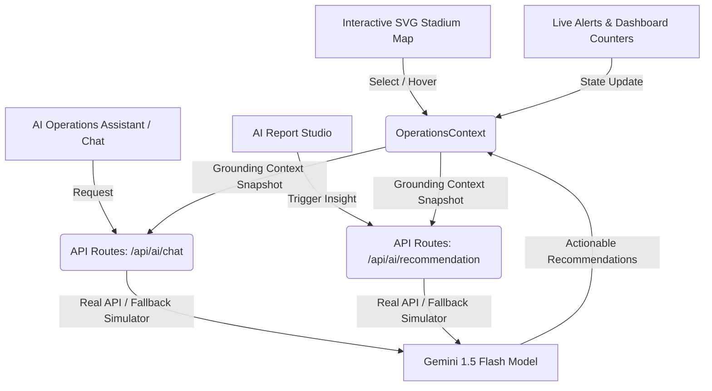

# 🏟️ StadiumPilot AI — Operations Command Center

[](https://stadiumpilot-bot.vercel.app/)
[](https://stadiumpilot-bot.vercel.app/)
[](https://stadiumpilot-bot.vercel.app/)
[](https://stadiumpilot-bot.vercel.app/)

StadiumPilot AI is an AI-powered command center and decision-support platform designed for large-scale tournament venues (such as the FIFA World Cup 2026). It integrates live telemetry, dynamic maps, automated reports, and Google Gemini AI insights to empower stadium coordinators.

🔗 **Production Live Site**: [https://stadiumpilot-bot.vercel.app/](https://stadiumpilot-bot.vercel.app/)

---

## 🏗️ Architecture Design & Flow



### 1. Unified State Layer (`OperationsContext.js`)
* **Single Source of Truth**: Grounded operations telemetry (visitor count, density metrics, volunteer queues, weather states, active incidents, and coordinate mapping).
* **Live Telemetry Loop**: Simulates realistic fluctuations in crowd load, ingress rates, transit counts, and alert feeds.
* **Grounding Engine**: Bundles the active dashboard snapshot to feeds before querying the AI models, ensuring recommendations remain contextually aware.

### 2. Interactive SVG Map (`StadiumMap.js`)
* **Native SVG Animations**: Incorporates rotating radar grids, horizontal laser scanners, pulsing nodes, and glowing breathing neon rings built using high-performance native `<animate>` and `<animateTransform>` tags to preserve CPU thread capacity.
* **Anti-Overflow Label Clipping**: Uses SVG `<clipPath>` definitions for text-wrapping boundaries alongside `<tspan>` splitting to avoid label overlap in constrained structures like Gate A/B/C/D and Medical slots.

### 3. Gemini AI Pipeline
* **Endpoints**:
  * `/api/ai/chat`: Interactive chat grounded in active metrics.
  * `/api/ai/recommendation`: Generates structured JSON reports containing summaries, crowd predictions, reasoning chains, and tactical recommendations.
* **Demo Sandbox**: Seamlessly falls back to a deterministic rule-based simulation engine when the API key is not present, enabling complete offline functionality.

### 4. Enterprise Security Layer
* **Response Headers**: Implements strict Content Security Policy (CSP), anti-clickjacking `X-Frame-Options: DENY`, `X-Content-Type-Options: nosniff`, and Referrer policies.
* **API Sanitization**: Strips HTML tags from incoming requests, limits token lengths, and rejects invalid payload formats.

---

## 🛠️ Technology Stack

| Component | Technology | Detail |
|---|---|---|
| **Core Framework** | Next.js 14.2 (App Router) | Static compilation & dynamic server-side routing |
| **Logic & UI** | React 18 & Tailwind CSS | Dark mode design & modular structure |
| **Icons** | Lucide React | Clean, scalable vector icon design |
| **Charts** | Recharts | Responsive charting and time-series indexes |
| **AI Integration** | Google Generative AI | SDK support for Gemini 1.5 Flash |
| **Testing Suite** | Jest & Testing Library | Assertions, DOM mocks, and coverage tracing |

---

## 📂 Project Directory Structure

```
stadiumpilot-ai/
├── src/
│   ├── app/
│   │   ├── api/
│   │   │   ├── ai/
│   │   │   │   ├── chat/route.js            # Input validation & Chat API
│   │   │   │   └── recommendation/route.js  # JSON schema & Recommendations API
│   │   │   └── ...
│   │   ├── operations-assistant/            # Chat panel interface
│   │   ├── reports/                         # Operations report studio
│   │   ├── settings/                        # Control Center panel
│   │   ├── globals.css                      # Design system styling tokens
│   │   └── layout.js                        # Font loaders & base layouts
│   ├── components/
│   │   ├── AppShell.js                      # Frame shells & mobile drawers
│   │   ├── Header.js                        # Sticky headers & role toggles
│   │   ├── Sidebar.js                       # Collapsible nav drawer links
│   │   ├── StadiumMap.js                    # Core SVG map and animations
│   │   └── CrowdChart.js                    # Dynamic time-series line chart
│   └── context/
│       └── OperationsContext.js             # Telemetry loop & state provider
├── jest.config.js                           # Coverage paths & module maps
├── jest.setup.js                            # Fetch & scrollIntoView polyfills
└── tailwind.config.js                       # Tailwind custom color palettes
```

---

## 📦 Getting Started & Commands

### 1. Installation
```bash
npm install
```

### 2. Set Up Environment Variables
Create a `.env.local` file in the root directory:
```env
GEMINI_API_KEY=your-gemini-api-key-here
```

### 3. Run Linter
Verify code quality and rule conformance:
```bash
npm run lint
```

### 4. Run Test Suite
Run Jest unit tests and check code coverage:
```bash
npm run test
```

### 5. Launch Local Dev Server
```bash
npm run dev
```

### 6. Production Compilation & Run
```bash
npm run build
npm start
```
